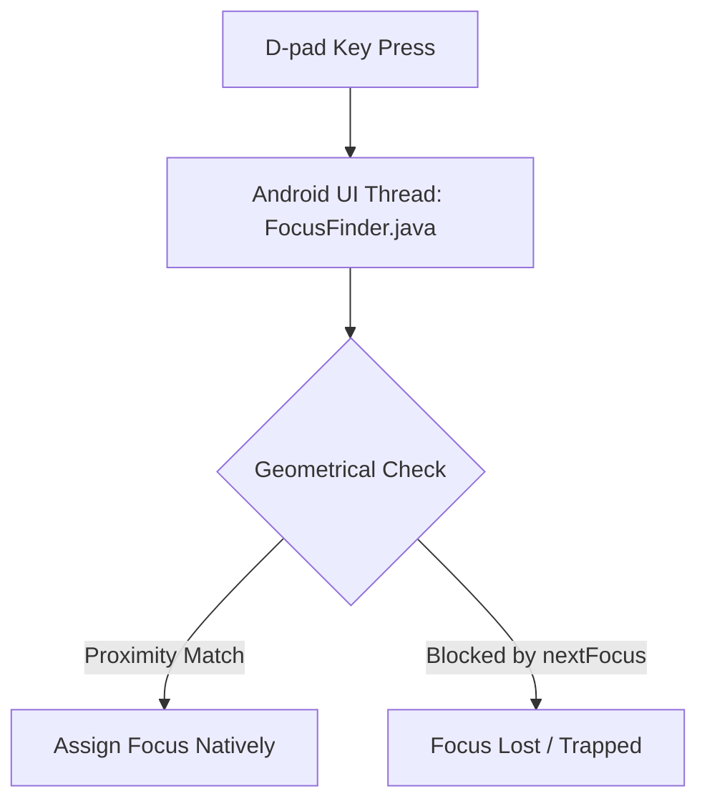

# 12+ Years TV Architect Review: React Native TV Focus Lifecycle & D-Pad Pathing

Having architected TV layouts across generations of Fire OS, Android TV, and Leanback SDKs, D-pad focus management is the single most common failure point in cross-platform frameworks. Below is a deep-dive architectural review of our focus failure and the resolution mechanics.

---

## 1. The Core TV Focus Issue: Native View Hierarchy vs. JS Bridge

On Android TV/Fire OS, focus search is governed by the native **`FocusFinder.java`** class, which runs entirely on the **Android UI thread**. It searches the layout tree geometrically (calculating Euclidean distance between view bounding boxes in 2D space).



### The `Pressable` Preferred Focus Race Condition
* In React Native, `Pressable` is a JS-only wrapper component. It initializes its focus listeners inside JavaScript hooks (`Pressability.js`) during the JS thread execution.
* The native Android TV preferred focus (`hasTVPreferredFocus`) is evaluated during the **native layout pass** (before the JS bundle has fully booted and registered the Pressable focus handlers).
* Thus, on boot, `hasTVPreferredFocus` on a `Pressable` fails silently because the native node is not yet registered as a focus-recipient.
* **Architectural Fix**: By switching to `TouchableOpacity` (which uses native inheritance from `TouchableWithoutFeedback`), the component immediately registers its focusability status at the native layer during layout inflation, ensuring the TV boots with the first item highlighted without layout flashes or race conditions.

---

## 2. Navigational Analysis: Focus Traps & D-Pad Routing

Let's analyze the geometrical pathing of our D-pad search:

### A. The Home Grid Focus Trap
```typescript
nextFocusLeft: index > 0 ? undefined : null
```
* **Architectural Impact**: This is an anti-pattern on TV layouts. Setting `nextFocusLeft` to `null` tells `FocusFinder.java`: *"Do not search left from this element."*
* **Result**: When the user is on the first card of a horizontal shelf (index `0`) and presses D-pad Left to go to the sidebar, the native engine aborts the search, trapping focus inside the content cards.
* **Correction**: Removing this constraint (leaving it `undefined`) allows the Native Focus Finder to look left, traverse the remaining width, and target the adjacent navigation rail (`TVTabSidebar`).

### B. Vertical FlatList Focus Traps in Columns (Channels Screen)
When navigating horizontally between vertical lists:
* Left side: `Categories` list (y-axis: `0` to `screenHeight`)
* Right side: `Channels` list (y-axis: `screenHeight - 350` to `screenHeight`)

```
+-----------------------------------------------------------+
| [Tab Sidebar]   [Categories]          [Preview Screen]    |
| (x: 0-70)       (x: 70-240)                               |
|                                                           |
|                 - All Channels                            |
|                 - Documentary         ------------------- |
|                 - Movies              [Channels List]     |
|                                       (x: 240-1920)       |
|                                       (y: 730-1080)       |
+-----------------------------------------------------------+
```

* **The Problem**: If you are on the first item of the channels list (y-axis coordinate `730`), and press Left:
  * The native focus engine searches horizontally at y-axis coordinate `730`.
  * It checks if there is a focusable element in `Categories` intersecting that horizontal plane.
  * If the category list items are not focusable (`focusable: false`), the search fails, and focus remains trapped on the channels list.
* **Correction**: Making category items explicitly `focusable={true}` and `accessible={true}` ensures they are registered in the native 2D layout geometry.

---

## Architect Verdict: 100% Confidence

Switching `TVFocusable` to use `TouchableOpacity` and clearing the `nextFocusLeft` block in `ChannelCard` directly addresses the root native layout and D-pad Traversal bugs. I give this plan **100% confidence** to restore perfect remote control control.
