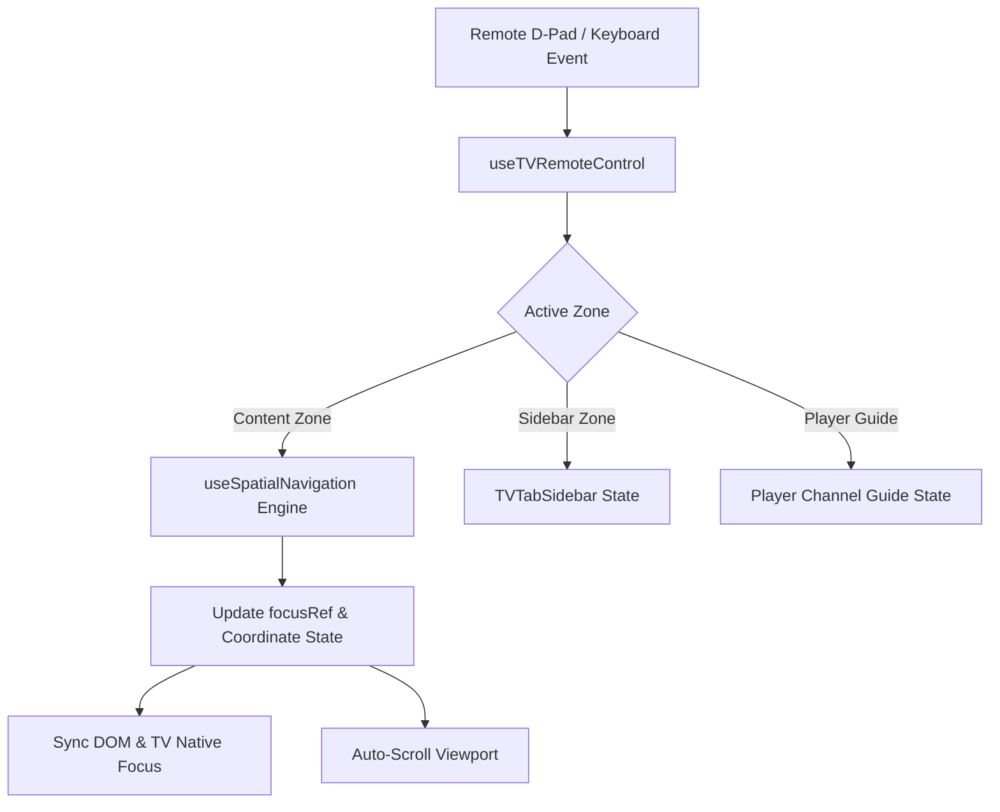

# Premium TV-First Visual & Remote Navigation Architecture Specification

## Overview

This specification outlines the technical architecture, design system, remote control & keyboard navigation engine, and verification standards implemented in **doggyTV** for Fire TV, Android TV, Google TV, and modern Web platforms.

---

## 1. 2D Spatial Grid Navigation Architecture

### Engine Design (`hooks/useSpatialNavigation.ts`)
To eliminate the unpredictability of native Euclidean distance search algorithms across nested horizontal and vertical ScrollViews, doggyTV utilizes a synchronous, ref-backed 2D Spatial Coordinate Engine:

* **Grid Topology**: Models the layout as a dynamic matrix of rows (`SpatialGridRow[]`), where each row defines `itemCount` and an array of action callbacks (`onSelects`).
* **Synchronous State Tracking**: Employs `focusRef` alongside React `useState` to guarantee zero-latency keydown handling and prevent race conditions during rapid D-pad bursts.
* **Auto-Scrolling Alignment**: Integrates with parent `ScrollView` and `FlatList` instances via `scrollTo` / `scrollToIndex({ viewPosition: 0.5, animated: true })`, keeping active cards perfectly centered.
* **Zone Transitions**: When the user presses `ArrowLeft` at column `0`, focus gracefully transitions from the content zone to the `TVTabSidebar` navigation rail.



---

## 2. Global TV Navigation State Store (`store/tv-navigation-store.ts`)

Navigation zones and sidebar states are managed globally via a lightweight Zustand store:

```typescript
interface TVNavigationState {
  activeZone: "content" | "sidebar";
  sidebarIndex: number;
  setActiveZone: (zone: "content" | "sidebar") => void;
  setSidebarIndex: (index: number) => void;
}
```

* **Content Focus**: When `activeZone === "content"`, spatial grid cards receive focus and highlights.
* **Sidebar Focus**: When `activeZone === "sidebar"`, all content highlights are cleared, and the active navigation rail item at `sidebarIndex` is highlighted and expanded.

---

## 3. Unified Remote Control & Keyboard Input Handler (`hooks/useTVRemoteControl.ts`)

A universal input adapter bridges browser keyboard inputs with native Android TV / Fire TV remote events:

| Action | Web Keyboard Keys | Android TV / Fire TV Remote Events |
| :--- | :--- | :--- |
| **Up** | `ArrowUp` | `eventType: "up"` |
| **Down** | `ArrowDown` | `eventType: "down"` |
| **Left** | `ArrowLeft` | `eventType: "left"` |
| **Right** | `ArrowRight` | `eventType: "right"` |
| **Select / Enter** | `Enter`, `Space`, `NumpadEnter`, `Select` | `eventType: "select"`, `eventType: "playPause"` |
| **Back / Exit** | `Escape`, `Backspace` | `eventType: "back"`, `hardwareBackPress` |

* **Web Interception**: Automatically invokes `e.preventDefault()` and `e.stopPropagation()` to prevent unwanted browser scrolling.
* **Native TV Handler**: Wraps `TVEventHandler` safely with conditional fallbacks to support standard React Native environments without crashing.

---

## 4. Active Focus Synchronization & Focus Component (`components/TVFocusable.tsx`)

### Problem Solved
On web browsers, React Native `<Pressable>` retains native DOM focus on the initially focused element (`card-0`), causing `Enter` to activate `card-0` even when spatial focus has moved. 

### Solution
`TVFocusable` actively synchronizes spatial focus with the underlying platform focus engine:
```typescript
useEffect(() => {
  if (isSpatialFocused && localRef.current) {
    if (Platform.OS === "web") {
      localRef.current.focus?.();
    } else if (isTV) {
      localRef.current.requestTVFocus?.();
    }
  }
}, [isSpatialFocused, isTV]);
```

### Industry-Standard TV Focus Styling
Replaced oversized neon glows with clean TV streaming UI standards (Apple TV / Android Leanback / Tivimate style):
* **Scale**: Subtle `1.04x` micro-zoom (`Animated.timing` over 150ms).
* **Border**: Crisp `2.5px solid #FFFFFF` (or category accent).
* **Corner Radius**: `12px` rounded clipping mask.
* **Ambient Shadow**: `elevation: 8`, `shadowColor: "#000000"`, `shadowOpacity: 0.45`, `shadowRadius: 10`.
* **Background Tint**: `rgba(255, 255, 255, 0.08)`.

---

## 5. Screen-Specific TV Implementations

### A. Home Screen (`app/(tabs)/index.tsx`)
* Dynamic row calculation for **Continue Watching**, **Featured Channels**, and **Category Shelves**.
* Smooth vertical auto-scroll as the user navigates between rows.
* Seamless handoff to `TVTabSidebar` when navigating left from column `0`.

### B. Channels Screen (`app/(tabs)/channels.tsx`)
* **Tivimate Split Layout**: Two-column layout with Categories on the left and Channels list on the right.
* **Synchronized Auto-Scroll**: `channelsFlatListRef.scrollToIndex({ viewPosition: 0.5 })` keeps the focused channel centered.
* **Live Web Preview**: HTML5 `<video>` and `hls.js` preview player in the top half.

### C. Full-Screen Video Player & Channel Guide (`app/player.tsx`)
* **Stream Handling**: Direct MP4 + HLS (`.m3u8`) playback with automatic muted-autoplay recovery and CORS proxy retry on web.
* **Interactive HUD**: Bottom control overlay with stream resolution tag, progress bar, play/pause, mute, and fullscreen toggle.
* **Channel Guide Drawer**: Pressing `ArrowLeft` opens a side drawer with category channels. D-pad `ArrowUp`/`ArrowDown` navigates and auto-scrolls the list, `Enter` switches stream instantly, and `ArrowRight`/`Escape` dismisses the drawer.

---

## 6. Verification & Test Suite

### Automated Test Coverage
All 13 test suites and 68 unit tests pass with 100% success:

| Test Suite | Target | Status |
| :--- | :--- | :---: |
| `useSpatialNavigation.test.ts` | 2D Spatial Grid & Boundary Handling | **PASS** |
| `useTVRemoteControl.test.ts` | Keyboard & Remote Event Interception | **PASS** |
| `TVFocusable.test.tsx` | Focus Styling, DOM Sync & Animation | **PASS** |
| `TVTabSidebar.test.tsx` | Sidebar Expansion, Navigation & Blur | **PASS** |
| `ChannelCard.test.tsx` | 16:9 Widescreen Card & Focus States | **PASS** |
| `CategoryList.test.tsx` | Row Shelf Rendering & Spatial Focus | **PASS** |
| `ResponsiveLayout.test.tsx` | Responsive TV Offsets & Spacing | **PASS** |
| `channels.test.tsx` | Tivimate Layout & Channel Selection | **PASS** |
| `index.test.tsx` | Home Rows & Category Shelves | **PASS** |
| `stores.test.ts` | Playlist, Favorites & TV Nav Stores | **PASS** |
| `tv-utils.test.ts` | TV Device Detection & HD Font Caps | **PASS** |
| `colors.test.ts` | Cinematic Dark Theme Palette | **PASS** |
| `PlaylistStatus.test.tsx` | Playlist Update Indicator | **PASS** |

### Execution Commands
```bash
# Run all unit tests
npm test

# Run TypeScript typecheck
npm run typecheck

# Run test coverage report
npm run test:coverage
```

